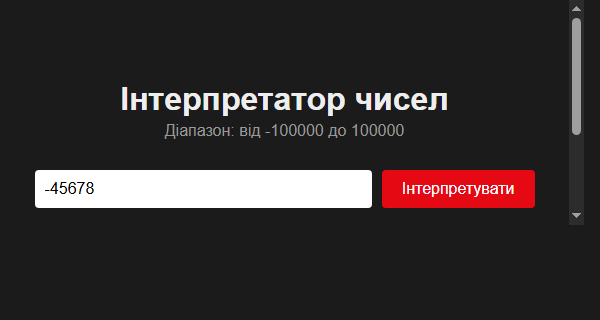

# Інтерпретатор чисел

Web-додаток на ASP.NET Core (.NET 9, C#), побудований за принципом ланцюжка
middleware-компонентів (на основі підходу з
[sunmeat/middlewares](https://github.com/sunmeat/middlewares)).

Перетворює число з діапазону **-100000 .. 100000** у текстовий опис українською мовою.
Для від'ємних чисел додається приставка **"мінус "**.

## Скріншот



## Архітектура

Запит `GET /interpret?number=...` проходить через ланцюжок із 6 власних
middleware (`app.UseMiddleware<T>()`), зареєстрованих у гілці `app.Map("/interpret", ...)`:

1. `Middlewares/ParseNumberMiddleware.cs` — зчитування та валідація числа з query-параметра
2. `Middlewares/SignMiddleware.cs` — обробка знаку (додає "мінус")
3. `Middlewares/ThousandsMiddleware.cs` — розряд тисяч (включно з рівно 100000)
4. `Middlewares/HundredsMiddleware.cs` — розряд сотень
5. `Middlewares/TensUnitsMiddleware.cs` — розряди десятків та одиниць
6. `Middlewares/FinalizeMiddleware.cs` — формування та надсилання JSON-відповіді

Стан між middleware передається через `HttpContext.Items` (аналог `req.*`
у Express-версії підходу з референсного репозиторію).

Словники слів та допоміжні функції винесені окремо в `Extensions/`:

- `Extensions/Dictionaries.cs` — масиви слів (одиниці, десятки, сотні, числівники 10-19)
- `Extensions/ConvertTripletExtensions.cs` — перетворення трицифрового числа у слова
- `Extensions/PluralizeExtensions.cs` — узгодження слова "тисяча/тисячі/тисяч"

## Запуск

```bash
dotnet run
```

Відкрити в браузері: `http://localhost:5140` (або порт з `Properties/launchSettings.json`)

## Приклади

- `GET /interpret?number=0` → `нуль`
- `GET /interpret?number=-45678` → `мінус сорок п'ять тисяч шістсот сімдесят вісім`
- `GET /interpret?number=100000` → `сто тисяч`
- `GET /interpret?number=21` → `двадцять один`
